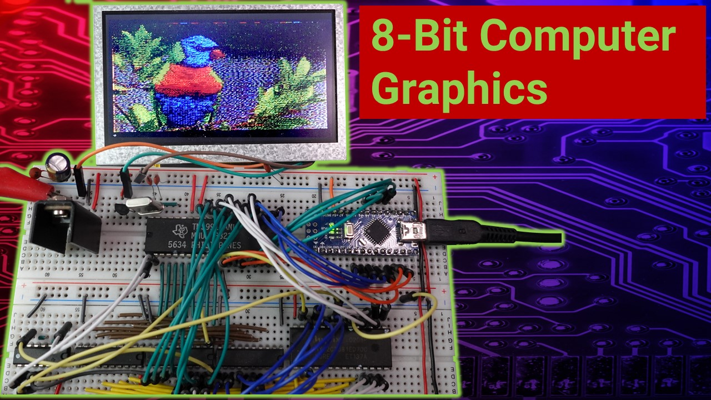

# TMS9918_Arduino Library
## Arduino library for the TMS9918A, TMS9928A and TMS9929A Video Display processors.

The TMS9918 library is designed for Arduino Nano and Uno, wired to the VDP as shown in the the [schematic](/schematic/schematic.pdf). For different wiring or other platforms, adjust the *Core IO functions* in the [tms9918.cpp](src/tms9918.cpp) source file accordingly.

Copy all to the *library* folder of your Arduino IDE to install the library. Check out the [examples](/examples/readme.md).

See the [documentation](html/tms9918_8h.html) for more details.

Watch video to learn more about the TMS9918.

